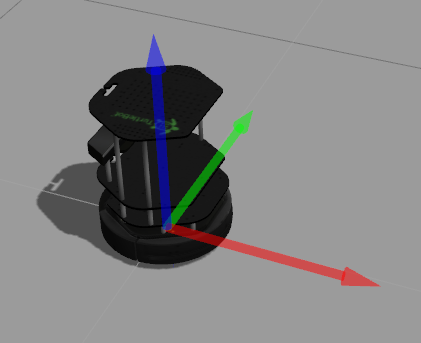

# Creating a reactive turtlebot

Last week you created a behaviour for the turtlebot that was unaware of the environment. This week we will try to use one of the robot's sensors (the emulated laser provided by the Kinect) to perceive and react to the environment.

## Perceiving the outside world

Per definition, robots have to have an embodiment, actuators like wheels, and sensors like the Kinect or odometry to be considered a robot. Most mobile robots have a laser scanner to create an accurate 2D representation of the outside world. As you have seen in the lecture, this is basically a range of distances created by the laser beams hitting objects and being bounced back. The turtlebot uses its Kinect to emulate this type of sensor.

### Visualising the laser scan

In the first workshop we played with the simulator and you already had a look at the laser scan. We will now try to do the same with the real robot:

* Start rviz in a new terminal on your PC:
 
 ```
 source ~/ros-network.sh <robot IP>
 roslaunch turtlebot_rviz_launchers view_robot.launch
 ```
 with `<robot IP>` being the IP address of your robot.
* In rviz, tick the box next to `LaserScan` in the left control panel
* Try and move the robot around by hand and see how the laserscan changes.
* Try and observe what happens with the laser scan when you hold your hand very close in front of the robot. 
* What effects do you observe and why is that the case?

### Analysing the LaserScan message

* Have a look at the actual laser scan message: _Maximising the terminal is a good idea before running this_

 ```
rostopic echo -n 1 /scan
 ```
* Discuss what `min_range`, `max_range`, and `ranges` could be.

## Creating a reactive robot behaviour

In this exercise we want to create a robot that uses its laser to react to the outside world. The behaviour should be purely reactive and therefore includes some randomness. Desired behaviour:

* The robot goes straight at a pre set speed
* If the robot comes close (pre defined distance) to an obstacle it stops its forwards movement and turns in a random direction.
* If there is no obstacle close enough after the turn, the robot should move straight again until finding the next obstacle on is path
* If after the turn there still is an obstacle, the robot executes another random turn

In order to achieve this behaviour, we need a so-called callback function that is triggered when ever the laser send another scan. Please have a look at the code snippet below that gives a basic template for this task. Pay attention to the comments in the code to understand what it does. If you find the `...` that means we left something out for you to fill in and make it work. Of course there are many solutions to this problem and the one we envisioned might not even be the best. Please feel free to try out your own solution as well.

Regarding the determination of the angular velocity, this is in radians per second. Please have a look at the [Wikipedia article about radians](http://en.wikipedia.org/wiki/Radian) to find out more.

If you did not set up a workspace last week and do not know how to launch spyder, please follow the instructions here: [[First Turtlebot Coding]].

The following code should be put in a file in the same package you create last week:

When in spyder press `Ctrl+N` to create a new file and save it with `Ctrl+S` under
`catkin_ws/src/commanding_velocity/scripts` as `laser_roomba.py`. Afterwards please make it executable by running `chmod a+x ~/catkin_ws/src/commanding_velocity/scripts/laser_roomba.py`.

```python
#!/usr/bin/env python
# -*- coding: utf-8 -*-

import rospy                           # The ROS python bindings
from sensor_msgs.msg import LaserScan  # The message type of the laser scan
from geometry_msgs.msg import Twist    # The cmd_vel message type
import numpy as np                     # Python's advanced math library
from random import choice, randint     # Could be used for the random turning of the robot


class LaserRoomba():
    """A class to make the turtlebot move like a roomba using the laser scanner
    """

    # __init__ is a built-in python function and needs to start and end with *two* underscores
    def __init__(self, name):
        """Function to initialise the class. Called when creating a new instance
        
        :param name: The name of the ros node
        """

        rospy.loginfo("Starting node %s" % name)
        self.laser_sub = rospy.Subscriber(  # Creating a subscriber listening to the laser scans
            "...",                          # The topic to which it should listend
            LaserScan,                      # The data type of the topic
            callback=self.laser_callback,   # The callback function that is triggered when a new message arrives
            queue_size=1                    # Disregard every message but the latest
        )
        self.cmd_vel_pub = rospy.Publisher( # The same as last week
            "...",                          # The topic to which it should publish
            Twist,                          # The data type of the topic
            queue_size=1                    # Explicitly set to prevent a warining in ROS
        )

    def laser_callback(self, msg):
        """A callback function that is triggered when ever a new message arrives
        on the topic that is defined by the subscriber.
        
        :param msg: The message received by the subscriber of the type as defined when creating the subscriber
        """
        
        ranges = msg. ...                 # Getting the range values of the laser rays
        min_distance = np.nanmin(ranges)  # Using numpy's nanmin function to find the minimal value and ignore nan values
        rospy.loginfo("Minimum distance: %f" % min_distance)
        twist_msg = Twist()        # Creating a new Twist type message
        if ...:                    # If the robot is close, then
            rospy.loginfo("Turn")  # Turn the robot
            rate = rospy.Rate(10)  # Set a rate of 10hz
            now = rospy.Time.now().to_sec()          # Get the current time as seconds.milliseconds
            end_time = now + ...                     # Defining for how long the robot should turn.
            angle_velocity = ...                     # Defining the angular velocity and direction of the turn. Use np.pi to get PI.
            while ...:                               # While the run time is not up, do
                twist_msg.linear. ...                # Set linear speed
                twist_msg.angular. ...               # Set angular speed
                self.cmd_vel_pub.publish(twist_msg)  # Publish Twist message
                rate.sleep()                         # Sleep to ensure rate of 10hz
        else:                                    # If the robot is far away from everything, then
            rospy.loginfo("Straight")
            twist_msg.linear. ...                # Set linear movement
            twist_msg.angular. ...               # Set angular movement
            self.cmd_vel_pub.publish(twist_msg)  # Publish Twist message


# The block below will be executed when the python file is executed
# __name__ and __main__ are built-in python variables and need to start and end with *two* underscores
if __name__ == '__main__':
    rospy.init_node("laser_roomba")    # Create a node of name laser_roomba
    l = LaserRoomba(rospy.get_name())  # Create an instance of above class
    rospy.spin()                       # Function to keep the node running until terminated via Ctrl+C
```

When trying to create a working ROS node, please keep in mind the `min_range` and `max_range` values we observed in the scan message. What could they mean for your programme and where are the dangers when defining the distance and speed at which the robot should turn and the speed at which it should move forwards?

Here is the image of the turtlebots axis again to remind you how and where it can move



_Red: x, green: y, blue: z_

### Optional Task

If you still have time in the end of the lecture, try to create a more intelligent behaviour for your robot. The roomba's bumper is a quite primitive sensor compared to a laser. Try and exploit the wealth of information. Two examples would be:

* Only turn until there is enough space to move forwards instead of deciding how far to turn by random.
* Turn away from the obstacle instead of just deciding the direction by random. The LaserScan message contains a list of distances, one for each beam. Try to find the index of the minimum distance you found using the `.index()` operator of lists and experiment if this could tell you on which side of the robot the obstacle is. Example usage:

 ```
my_list = [5,8,1,6,3,12]
idx = my_list.index(6)
 ```