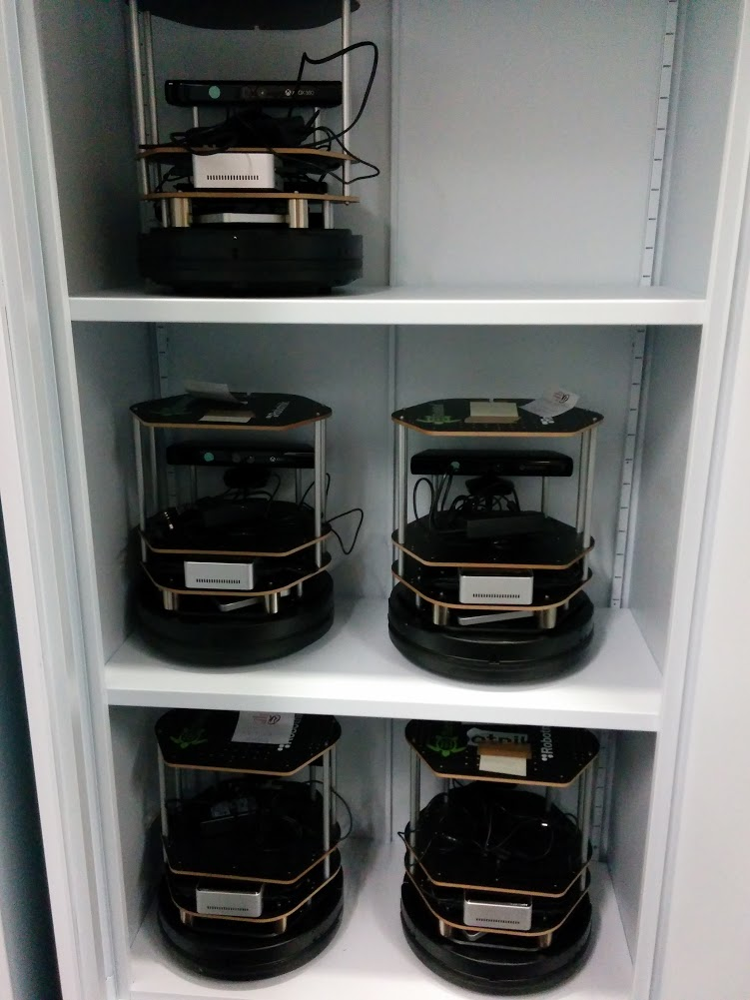
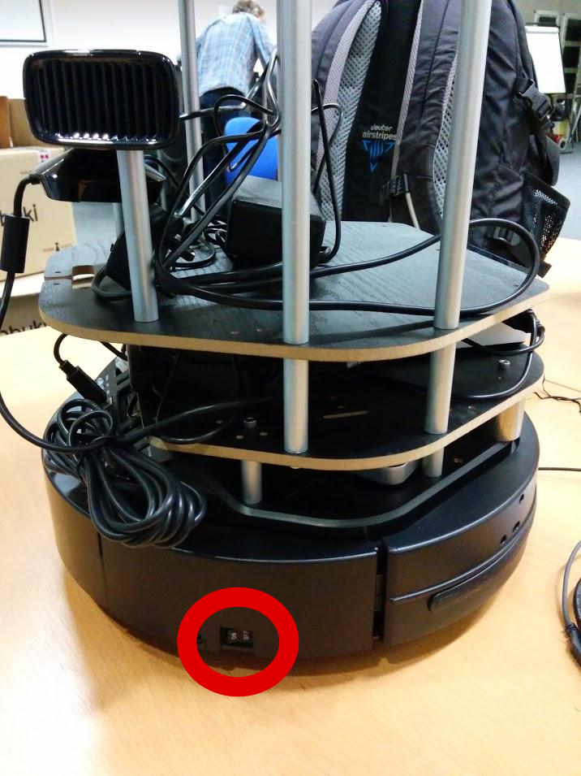
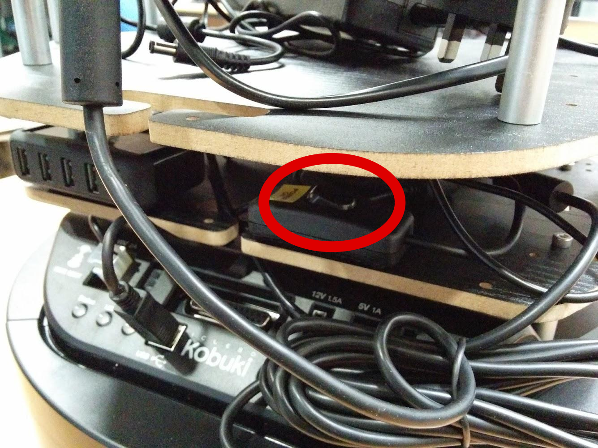

# Your Robots

Any practical exercises and assessments in this module are based on the [TurtleBot2](http://www.turtlebot.com/), a [Kuboki mobile robot base](http://kobuki.yujinrobot.com/home-en) equipped with a Microsoft Kinect for 3D perception.


Rather than having a netbook as indicated in the figure, our robots feature a more powerful [INTEL NUC](http://www.intel.co.uk/content/www/uk/en/nuc/nuc-kit-d54250wykh.html) embedded PC with an i5 processor. 

The School of Computer Science has 16 of such robots available for teaching.

In addition, we have set up a simulation environment for development of your software. All software is based on the [Robot Operating System (ROS)](http://www.ros.org/), a distributed, robot-focused, middleware and development environment used by thousands of robot developers world-wide.


## Handling your Turtlebot

* These robots are expensive device, please handle with extra care!
 * No turtlebot should ever be put on a table
 * No drink or food around the robots
 * If the robot breaks, we will not be able to guarantee you access to a replacement for the rest of the term
* Every robot has its fixed place in one of the cupboards. Please remember where your turtlebot lives and put it back where it belongs after the lecture.




### Turtlebot start-up
* During the second workshop you will be assigned a robot which you have to share with another student in the other workshop. You will therefore virtually have your own robot but please be aware that someone else is working on it as well. **So make regular backups of your code!**
 * You will get a user account on that robot with a dedicated username and password. Please remeber these details as you will need them to log in to the robot.
* Switch the main power button to __ON__



* Switch the button powering the PC to __ON__



* Start the PC by pressing its button


### Turtlebot shutdown and storage away

__AFTER__ using the robot, make sure you

1. Shut down the main PC on-board the robot by using ssh (see [connecting to the robot](https://github.com/LCAS/teaching/wiki/Turtlebots#connecting-to-the-robot)) and running: `sudo shutdown -h now` this will ask for your password and then shut down the PC.
1. Turn off the robot, both at the main power switch _and_ the separate switch for the PC (see images above). It has to be fully switched off or it will drain the battery!
1. Collect the charger unit and store it on the the robot's build-in shelf
1. Put the robot back at the same place you took it from: same cupboard, same shelf, same position (either left or right). Ask a demonstrator if unsure where to put it.


## Using your Turtlebot

### Connecting to the robot
This should only be necessary to start it and to update your code via a version control system, e.g. [github](www.github.com)

* Log in via ssh: `ssh -XC username@robot-ip`. `username` is the username you have been assigned, `robot-ip` is the ip of your robot. This process will also ask for your password. If it is the first time you connect to the robot from a PC it will ask you if you want to accept the fingerprint. Please answer yes and proceed to entering your password.
* To run a programme on your PC that executes commands on the robot, see [how to set-up your local environment](https://github.com/LCAS/teaching/wiki/Turtlebots#configuring-your-local-pc-environment-for-accessing-the-real-turtlebot). _This should be the default if you are not working with images or pointclouds._

### Starting the hardware drivers
For this command you need a new terminal and have to ssh into the robot first.

* Run the bringup file: `roslaunch uol_turtlebot_common turtlebot.launch` 

_This produces a series of warnings that you can ignore. If it displays errors (red text) please call a demonstrator._

## Working on your local PC
This uses ROS ability to communicate with a `roscore` on a different machine without needing an explicit ssh connection. All of this can therefore be done locally and you do not need to log in to the robot. But you have to set-up your working environment correctly as described blow.

### Configuring your local PC environment for accessing the real turtlebot

* In order to be able to talk to ROS components on your turtlebot, download the [`ros-network.sh`](https://gist.github.com/marc-hanheide/1ac6d9dfd6e89d4f6126) script
   ```
   wget https://gist.githubusercontent.com/marc-hanheide/1ac6d9dfd6e89d4f6126/raw/45028eb2a212c432e470b17a4c3998af6f13b09b/ros-network.sh -P ~/
   ```
  and run
  ```
  source ~/ros-network.sh <robot IP>
  ```

  with `<robot IP>` being the IP of your turtlebot. __Note:__ This needs to be run in every terminal you want to start components in that talk to your real robot.
 * `rostopic list` should now show you all the available topics on the robot.

